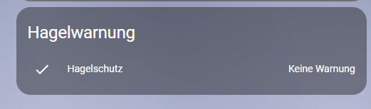
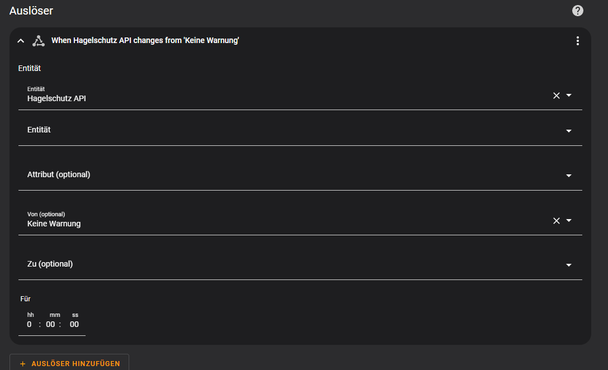
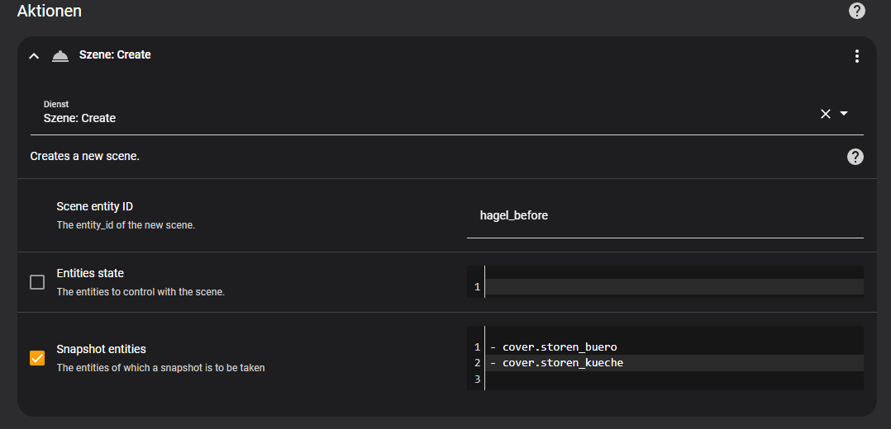
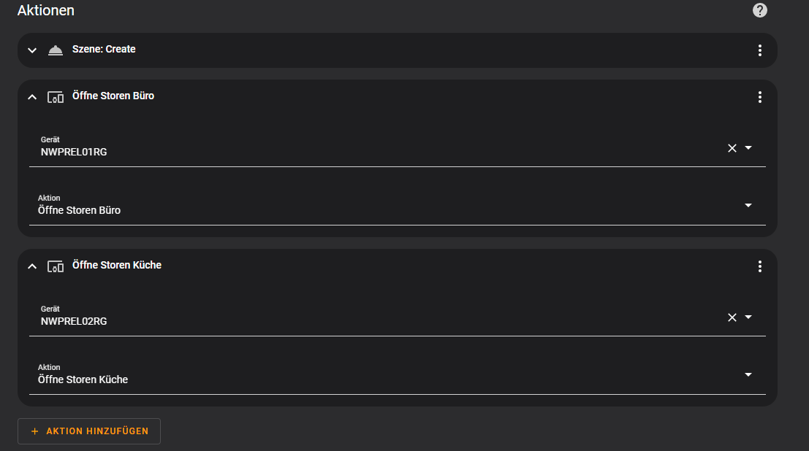
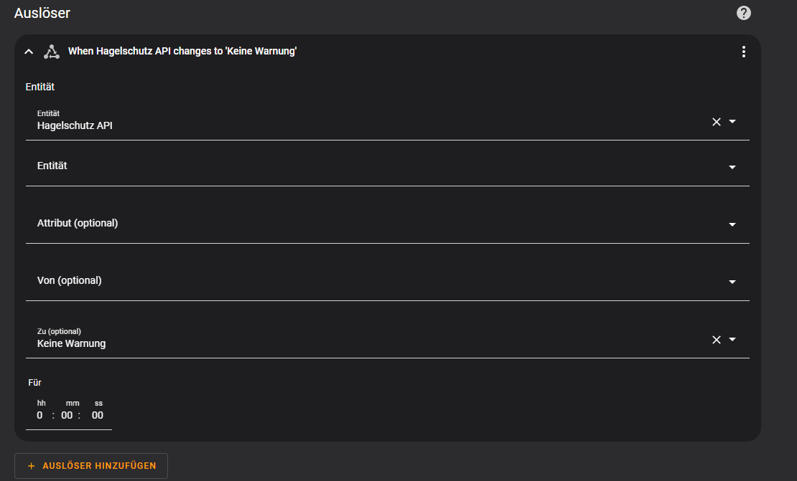
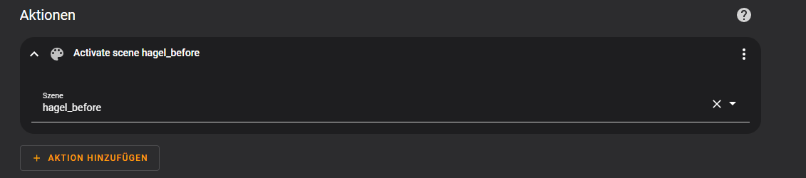

# Information/Registration
https://www.hagelschutz-einfach-automatisch.ch/eigentuemer-verwaltungen.html

# Integration via Yaml
VKF_Hagelschutz.yaml

# Visualisierung in HA

# Setup Automation "Hagelschutz - Warnung"
1. Erstellen einer Automation
2. Auslöser

3. Aktion
 
 

# Setup Automation "Hagelschutz - Entwarnung
1. Erstellen einer Automation
2. Auslöser

4. Aktion

